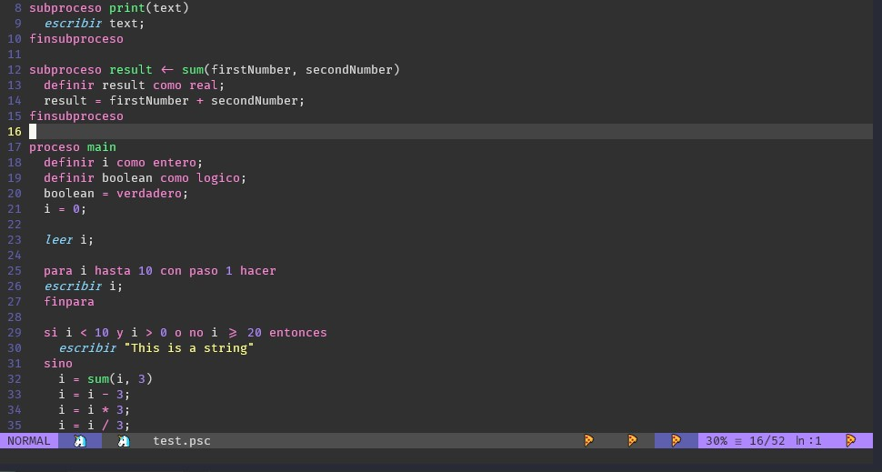

# PSeInt Syntax Highlighting Plugin for Vim


The Vim syntax highlighting plugin for PSeInt files

About
---

As a computer systems student mainly using Vim, I decided to make my own plugin to support [PSeInt](https://sourceforge.net/projects/pseint/) files. PSeInt is a pseudointerpreter for people who is learning programming and flowcharts.

Preview
---

  Color theme: [dracula](https://github.com/dracula/vim)

Installation
---

### [Vim-Plug](https://github.com/junegunn/vim-plug) (Recommended)
  Add the following line to your `.vimrc`
  ```
  Plug 'EddyBer16/pseint.vim'
  ```
### [Vundle](https://github.com/gmarik/vundle)
  Add the following line to your `.vimrc`
  ```
  Plugin 'EddyBer16/pseint.vim'
  ```

### [Pathogen](https://github.com/tpope/vim-pathogen)
  Run this command in your shell
  Note: You must have git installed in your system
  ```
  git clone https://github.com/EddyBer16/pseint.vim.git ~/.vim/bundle/pseint.vim
  ```
  
  License
  ---
  [MIT License](https://github.com/EddyBer16/pseint.vim/blob/main/LICENSE)
